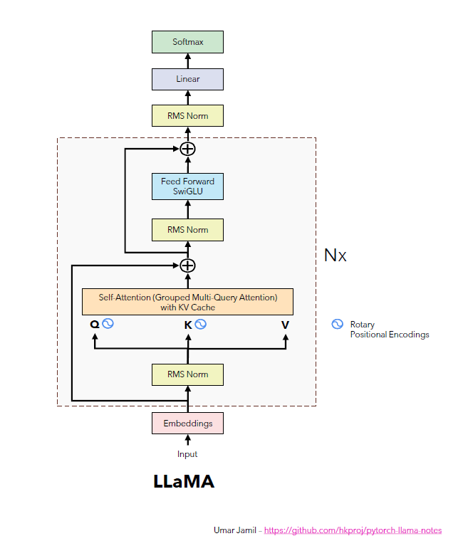

# Llama 2 Implementation in PyTorch

A clean, efficient implementation of Meta's Llama 2 language model architecture. This repository provides a PyTorch-based implementation focusing on core components like rotary positional embeddings (RoPE), grouped-query attention (GQA), and RMSNorm.

## Model Architecture



The above diagram illustrates the core components of the Llama 2 architecture:
- Pre-normalization with RMSNorm
- Self-attention with rotary positional embeddings
- Feed-forward network with SwiGLU activation
- Residual connections throughout the model

## Architecture Overview

### Key Components

1. **RMSNorm (Root Mean Square Normalization)**
   - Custom implementation of RMSNorm layer
   - Used for input normalization in attention and feed-forward layers
   - Includes learnable scaling parameters

2. **Rotary Positional Embeddings (RoPE)**
   - Implements complex-valued rotary embeddings
   - Precomputes theta position frequencies
   - Applies rotations to query and key vectors in attention

3. **Self-Attention with GQA**
   - Supports both regular attention and grouped-query attention
   - Implements efficient key-value caching for inference
   - Features configurable number of heads for queries (n_heads) and key-values (n_kv_heads)

4. **Feed-Forward Network**
   - Implements the SwiGLU activation function
   - Configurable hidden dimension with multiplier support
   - Supports dimension rounding to multiple_of parameter

### Model Configuration

The model is configured through the `ModelArgs` dataclass with parameters:
```python
- dim: Model dimension (default: 4096)
- n_layers: Number of transformer layers (default: 32)
- n_heads: Number of attention heads (default: 32)
- n_kv_heads: Number of key-value heads (optional)
- vocab_size: Vocabulary size
- max_seq_len: Maximum sequence length (default: 2048)
- max_batch_size: Maximum batch size (default: 32)
```

## Requirements

- Python 3.8+
- PyTorch
- dataclasses
- typing
- math

## Usage

1. Initialize model configuration:
```python
args = ModelArgs(
    dim=4096,
    n_layers=32,
    n_heads=32,
    vocab_size=32000,
    max_seq_len=2048
)
```

2. Create model instance:
```python
model = Transformer(args)
```

3. Forward pass:
```python
# tokens: torch.Tensor of shape (batch_size, 1)
# start_pos: integer indicating the starting position
output = model(tokens, start_pos)
```

## Implementation Details

### Attention Mechanism
- Implements efficient key-value caching for autoregressive generation
- Supports grouped-query attention for improved efficiency
- Uses rotary positional embeddings for position-aware attention

### Normalization
- Uses RMSNorm instead of LayerNorm
- Applied before attention and feed-forward blocks (pre-normalization)

### Feed-Forward Network
- Uses SwiGLU activation
- Implements dimension scaling and rounding
- Supports custom dimension multipliers

## Memory Efficiency

The implementation includes several memory-efficient features:
- Key-value caching for efficient autoregressive generation
- Grouped-query attention to reduce memory footprint
- Efficient handling of positional embeddings

## References

1. Llama 2: Open Foundation and Fine-Tuned Chat Models (Meta AI)
2. RoFormer: Enhanced Transformer with Rotary Position Embedding
3. GQA: Training Generalized Multi-Query Transformer Models from Multi-Head Checkpoints
